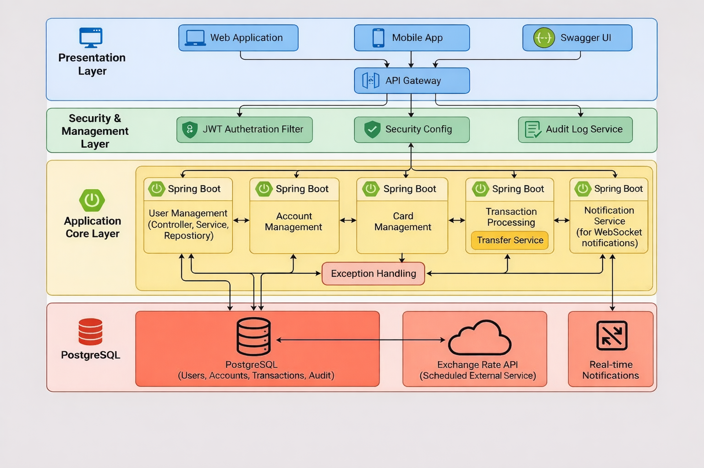

# J-Vault 

J-Vault is a core banking REST API built with Spring Boot. I created this project to simulate real-world banking operations, focusing on security, data integrity, and handling transactions cleanly.

Whether you want to manage multi-currency accounts, issue credit cards, or handle money transfers with live exchange rates, this API has it covered.

##  What it does

* **User Management & Security:** Secure registration and login using JWT (JSON Web Tokens) and refresh tokens. Role-based access control (User/Admin) is built-in.
* **Account Management:** Users can create accounts in RON, EUR, or USD. The system automatically generates valid, unique IBANs for every new account.
* **Cards:** You can issue virtual cards linked to accounts. The API generates realistic 16-digit card numbers (validated using the Luhn algorithm) and handles blocking/unblocking.
* **Transactions:** Supports deposits, withdrawals, account-to-account transfers, and card payments.
* **Live Currency Conversion:** Integrated with ExchangeRate-API (via Spring WebClient) to fetch live USD exchange rates and accurately convert money during cross-currency transfers.
* **Real-time Notifications:** Uses WebSockets (STOMP) to push real-time transaction notifications to the involved users.
* **Audit Logging:** Keeps a close eye on security. It logs sensitive user actions (like logins and password changes) along with IP addresses, and records the exact reasons for any failed transactions.
* **Concurrency Control:** Uses Optimistic Locking (`@Version`) to prevent race conditions if two transactions try to modify the same account balance at the exact same time.

##  Tech Stack

* **Java 17** & **Spring Boot 3**
* **Database:** PostgreSQL (with Spring Data JPA / Hibernate)
* **Security:** Spring Security + JWT
* **WebSockets:** For real-time user notifications
* **Containerization:** Docker & Docker Compose
* **Testing:** JUnit 5 & Mockito

##  How to run it locally

### 1. Prerequisites
Make sure you have [Docker](https://www.docker.com/) and Java 17 installed.

You'll also need a free API key from [ExchangeRate-API](https://www.exchangerate-api.com/) for the currency conversion feature.

### 2. Environment Variables
Before running the app, you need to set up a few environment variables. You can export these in your terminal or set them in your IDE:
```bash
export SECRET="your_super_secret_jwt_key_here_make_it_long"
export ENCRY="your_16_byte_aes_encryption_key"
export EXR_KEY="your_exchange_rate_api_key"
```
# Architecture
